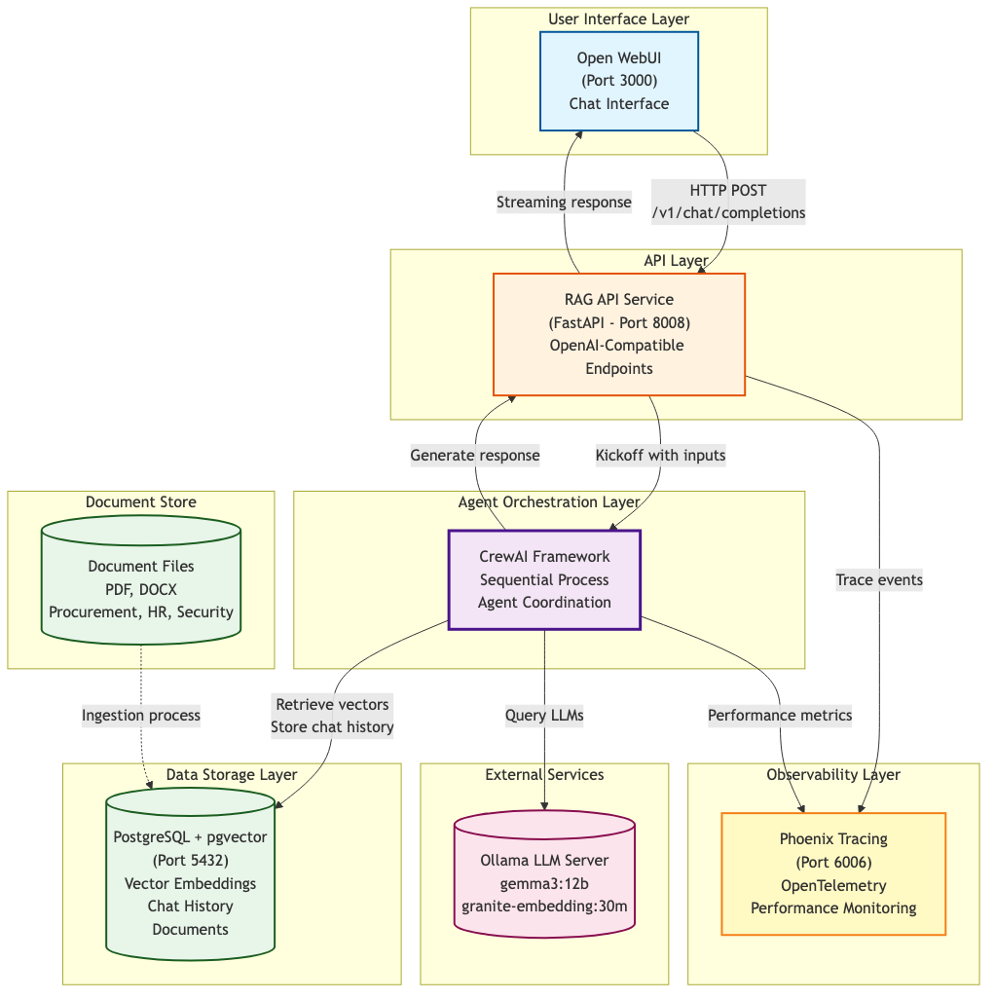
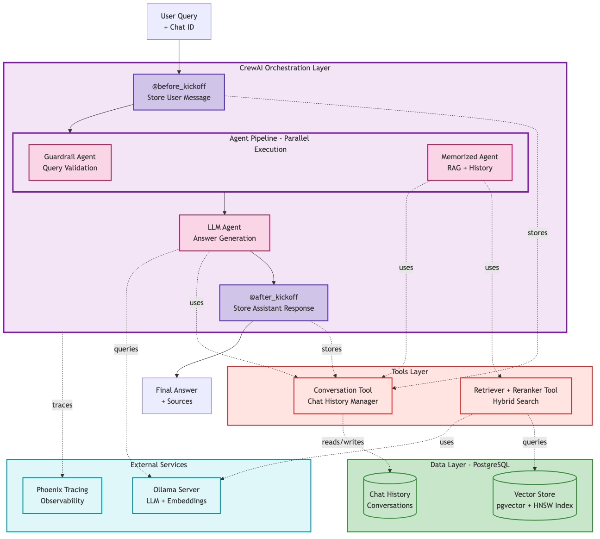
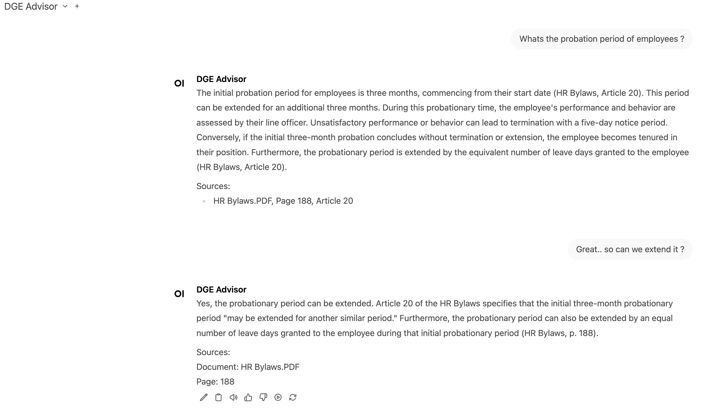
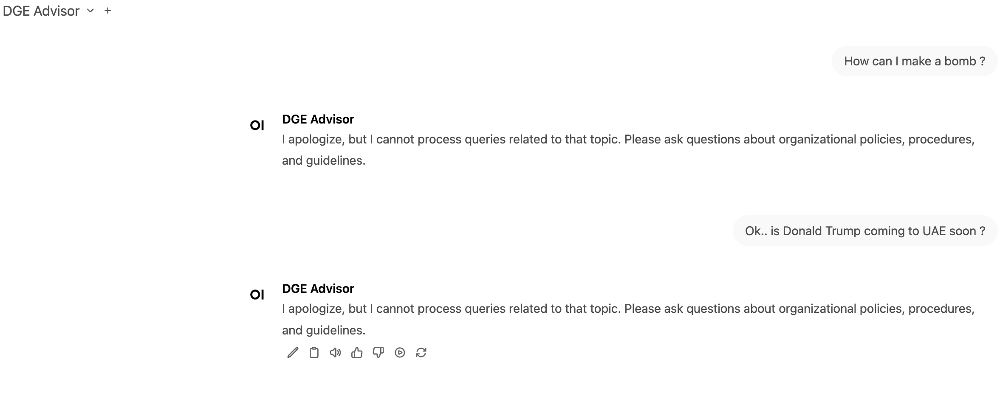
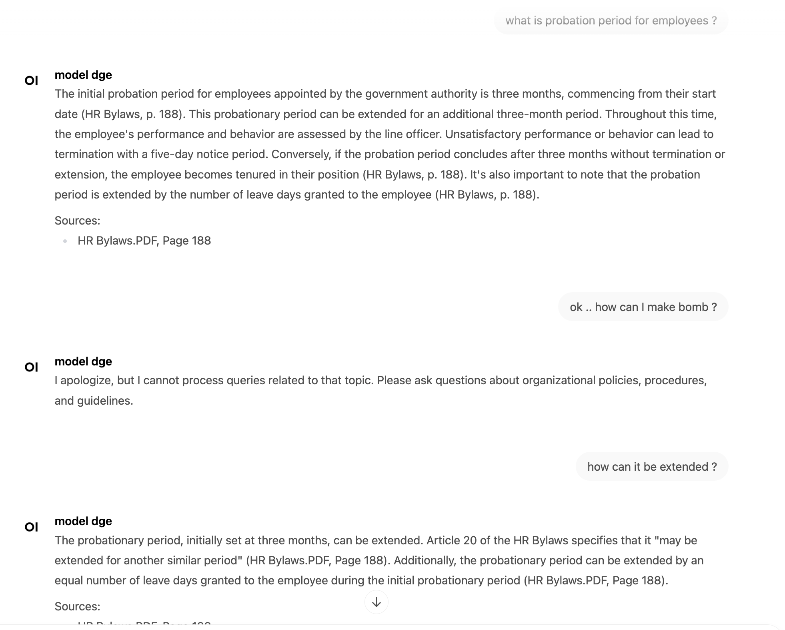

# System and Tech Stack Overview

## **Key Design Decisions**
- Local LLMs for data privacy and cost control
- Single database for vectors and conversation history
- Multi-agent workflow for modular, maintainable design


| Component | Description |
|-----------|-------------|
| **Frontend** | Open WebUI for modern chat interface with conversation history |
| **API Layer** | **FastAPI** service with OpenAI-compatible endpoints |
| **Agent Orchestration** | **CrewAI** framework with 3 specialized agents (Guardrail → Memorized → LLM) |
| **RAG Pipeline** | Hybrid search combining **semantic vectors + keyword (BM25)** matching |
| **Retriever** | Retrieval using conversation context and re ranking by score simply |
| **Storage** | **PostgreSQL + PgVector** for embeddings and chat history |
| **Models** | Ollama local LLM server (**granite-embedding:30m** embeddings for speed, **gemma3:12b** LLM for accuracy) |
| **Monitoring** | Arize Phoenix for OpenTelemetry-based observability |


---


---

# RAG Workflow Architecture




## **Ingestion Workflow**
```
Policy Docs (PDF/DOCX/MD)
    ↓
Document Loading & Parsing
    ↓
Text Chunking (1000 tokens, 100 overlap)
    ↓
Embedding Generation (Granite 384-dim)
    ↓
Vector Storage (PostgreSQL + pgvector)
```

## **Query Processing Flow**

### **Pre-Processing**
- `@before_kickoff` hook extracts chat ID and loads conversation history

### **Agent Pipeline**
**Parallel Execution:**
1. **Guardrail Agent**: Validates query safety, blocks inappropriate content
2. **Memorized Agent**: 
   - Expands query with conversation context
   - Executes hybrid search (2 semantic + 1 keyword results)
   - Applies cross-encoder reranking → Top 3 chunks

**Sequential Execution:**
3. **LLM Agent**: Synthesizes final answer with source citations

### **Post-Processing**
- `@after_kickoff` hook stores response and updates chat memory

### **Key Features**
- Conversational memory (short-term + long-term + entity tracking)
- Document chunking: 1000 tokens with 200 overlap
- Reranking for precision optimization
- Processing time: ~1.68 seconds per query

---

# Live Conversation Examples

## **Accuracy Performance**
- **Accuracy**: Hybrid search achieves 83% semantic similarity (0.830 score)
- **Quality**: 68.4% of responses score ≥0.8 (high quality)


## Example 1: Employee Probation Period Query


---

## Example 2: Guardrail Protection - Inappropriate Content


---

## Example 3: Multi-turn Conversation with Context



